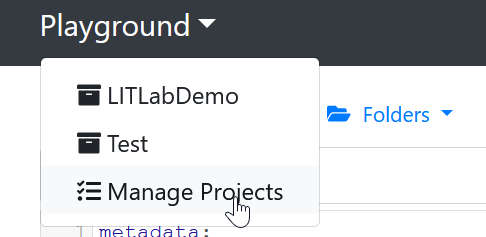
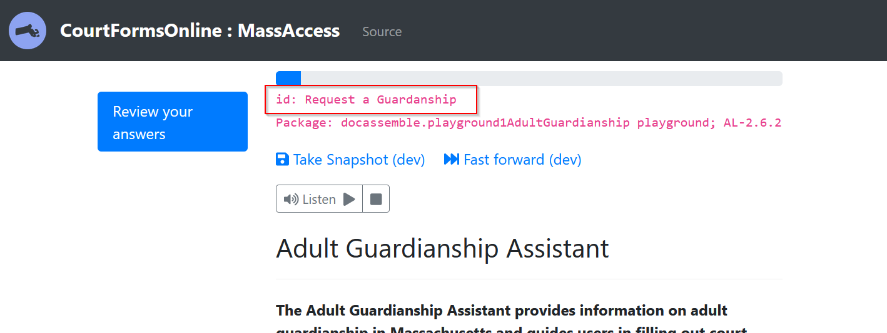

## Getting the draft into your playground

When you have finished using the Weaver, download your package. This will put a
.zip file in the Downloads folder on your computer.

:::caution If you are using Safari on a Mac OS computer
Safari, by default, will turn your downloaded package into
a folder on your PC.

Before downloading the package, turn off that behavior:

1. open Safari 
1. click Preferences
1. under the General tab, uncheck the option **Open 'safe' files after downloading**
:::

First, create a new "Project" in your playground. Using projects will
help you keep your Docassemble code organized.



Next, upload this file to the Docassemble playground's `Packages` folder.


## How to edit your interview

Navigate back to the main Playground window. You should see the YAML file
with your interview's draft code.

Scroll through and take a look at the code. You will see:

* code blocks setting defaults for your interview
* a `main order` and `interview order` block which list some of the variables
  that your interview uses, in order.
* `question:` blocks that contain the text of questions and the list of fields
  that are asked on each screen

You do not need to understand all of the code. Absorb what you can, and feel free
to experiment. Save your code often, preferably to a [GitHub](github.md) repository.

You will likely start by clicking the "Save and Run" button to try running your
interview through to the end. Note any awkward wording or changes you want to make.

Use the `id` that is on the top of each screen to find the screen that you want to change.
Then, simply change the text that you want to change, or change the order of fields.



Below we describe some of the most common starting customizations you will make,
especially changes that interact with an Assembly Line convention.
You can use any [Docassemble feature](https://docassemble.org/docs/fields.html)
in your interview.

## Changing the order of screens

Locate the `interview_order` block in your YAML file.
Move the variable name that you want to ask earlier in your interview to
the place you want it to be asked.

## Adding conditional logic to the screen order

If a screen is conditional, you can add an `if` statement so that it only
appears when the condition is satisfied.

Example:

```python
id: interview_order_Guardianship_Assistant
code: |
  users[0].name.first
  users.gather()
  if has_co_petitioner:
    users[1].address.address
  else:
    users[0].address.city
```    

## Adding conditional logic on an individual screen

To make a single field show or disappear on a screen that asks for
some optional information, use the `show if` modifier.

Example:

```yaml
---
id: Tell me more about Respondent
question: |
  Tell me more about the ${ other_parties[0] }.
fields:
  - Date of Birth: other_parties[0].birthdate
    datatype: date        
  - Primary Language: primary_language
    choices:
      - English
      - Spanish
      - Other
  - Other language: primary_language_other
    show if:
      variable: primary_language
      is: Other
```      

## Questions that you will not see in the Playground

You will not see any questions that come from our "question library". The
"question library" is used to standardize questions for things like selecting a
court, asking for an address, or asking someone's name. However, you may want to
customize those questions.

One way to customize the question is to click the "source" button. This will show you
the YAML code that is used to ask the question.


Scroll down until you see the question text. Copy it into your own YAML file
and make the changes that you want. You will need to type the `---` separator.
Paste it into a logical place, such as near other questions that are asked at about
the same time in your YAML file.

:::note About the variable `x`
If the question you want to customize uses the keyword `generic object`,
delete that line from the question. Also replace the variable `x` with
a specific variable name, like `users[0]`.
:::

A second way to customize the question is to look to see if it is listed as one
of the playground Example blocks.

In the Playground, scroll down until you see the heading "Example blocks".

1. Expand the menu labeled "Suffolk LIT Lab Assemble Line" and look to see if
   the block you want is listed. 
2. Click the green "insert" button to insert it at the position of your cursor
   in the Docassemble playground.


Replace any variable names to match the variable name you want to customize.
For example: replace `person` with `users[0]`. You may or may not want to delete
any `objects` block that comes along with the custom question.

## Customizing settings that you overlooked in the Weaver

### Setting the form type

If you are prompted to specify if the user is the plaintiff or defendant but
the user **always** is starting a new action, customize the value of 
`al_form_type`.

Look in your interview for a code block that sets the value of `al_form_type`.
If you do not see it, copy and modify the block below:

```yaml
---
code: |
  al_form_type = 'starts_case'
```

The valid values are:

- Starts a new court case: `'starts_case'`
- Filed in or responding to an existing court case: `'existing_case'`
- Part of an appeal of a court case: `'appeal'`
- Form that is not filed in a court: `'other_form'`
- Letter: `'letter'`
- Other: `'other'`

If the "form type" is not `starts_case` but the party using the form
is always the plaintiff or defendant, you can also set that directly:

```yaml
code: |
  user_ask_role = 'plaintiff'
```

Valid values are either `"plaintiff"` or `"defendant"`. Use these exact values
even if the form user is called "petitioner" or "respondent".

### Setting the number of people in a group, such as the number of `users`

If you are prompted to specify whether there is another user or opposing party
in a case but your form **always** allows only one user or other party,
customize the definition of `users` and `other_parties` in the `objects` block.

For example:

```yaml
---
objects:
  - users: ALPeopleList.using(there_are_any=True) # Will prompt one at a time
  - other_parties: ALPeopleList.using(ask_number=True, target_number=1) # Tells Docassemble there is exactly one other_party
 ```


## How to make changes safely

You can always:

1. change question and subquestion text
1. change the order of fields and questions
1. change any of the settings called out above

Avoid:

1. changing the name of variables until you know what you are doing
1. deleting code until you have first tried commenting it out

"Comment out" code by adding a single `# ` at the beginning of each line, like this:

```yaml
# question: |
#  I don't think this question is used any more
# fields:
#  - Field 1: variable_1
```

:::note Tip
To comment out many lines at once, hold the ALT key and click and drag a line 
with your mouse. If you do it correctly you will see a long blinking cursor.
Now you can type on multiple lines at once. Type a `#` and a space to comment out the lines
with the blinking cursor.
:::

If you want to discard your changes and start over, simply upload the package .ZIP file
to your playground again. This will wipe out all of your changes.

Use [GitHub](github.md) regularly to let you restore your work from a point in time.