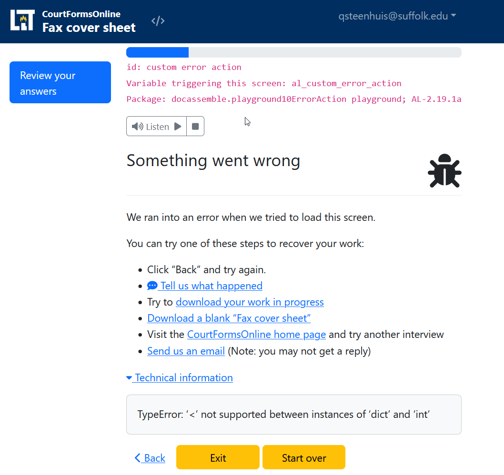
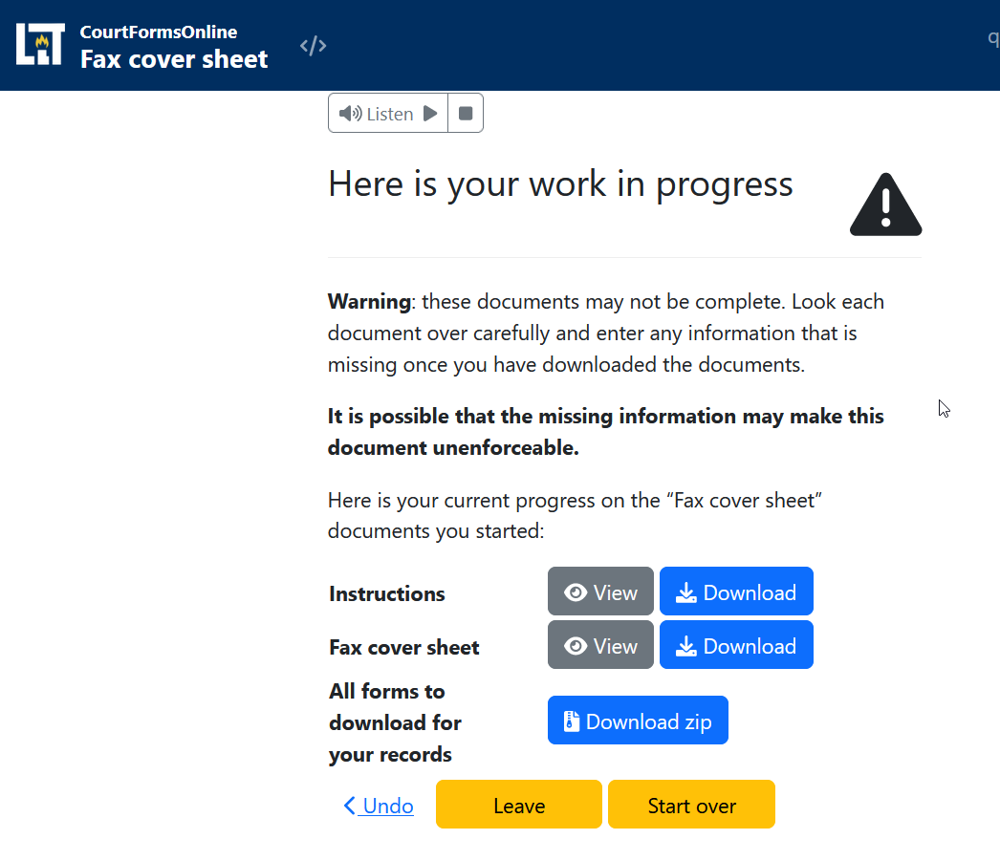

## Overview

If you would like to replace the stock Docassemble error page,
which is a bit unfriendly, you can configure that both system-wide
and on an interview-by-interview basis with the Assembly Line framework.

## Turning custom error pages on or off

The default Assembly Line configuration turns on a custom error handling page as of version 
`2.20.0`.

If you would like to turn the custom error page off, you can disable it like
this:

```yaml
---
metadata:
  error action: None
```

## Replacing the Assembly Line error page

You can override the custom error page by adding an event with the name `al_custom_error_action`.

See [https://docassemble.org/docs/initial.html#metadata](https://docassemble.org/docs/initial.html#metadata) to read the docassemble documentation about
what this event can do.

## Customizing the Assembly Line error page

By default the Assembly Line error page looks like this:



It always includes:

* The instruction to try clicking "back" and trying again
* A link to the page defined as `AL_ORGANIZATION_HOMEPAGE`
* Technical information (the exact Python error) in an expandable element

If it is defined, it will include a link to download the original blank form as specified in  `interview_metadata[]["original_form"]` (it will look in the "main_interview_key" if defined, and fall back to the first key in `interview_metadata` otherwise). This metadata key will be treated as a URL.

You can customize these optional links:

* A link to download the in-progress forms
* A link to email the server administrator
* A link to submit feedback using the GitHub feedback form
* A list of additional instructions.

The optional links have a two-step configuration. You can turn them
on or off globally in the system-wide configuration, or override the 
system-wide configuration on a per-interview basis.

```yaml
assembly line:
  enable incomplete downloads: True
  show email to user on errors: True
  enable error action feedback link: True
  custom error actions:
    - Call the trial court help line at 833-91COURT
```

Note that these settings all default to `False` if you have not added this section to
your global configuration.

Or configure at the interview level like this:

```yaml
---
code: |
  al_show_email_to_user_on_errors = False
---
code: |
  al_enable_incomplete_downloads = False
---
code: |
  al_enable_error_action_feedback_link = False
---
code: |
  al_custom_error_options = [
    "Send an email to [the helpline](mailto:help@example.com),
    "Call us at 1-800-GET-HELP",
  ]
```

The custom error options can include Markdown-formatted text or HTML, like the links in the example.

### Downloading incomplete documents

The custom error page will allow downloading of incomplete documents if
the global configuration option `assembly line: enable incomplete downloads` is set to `True`.

Turning this setting on will also add a menu item in the interview that allows the user
to download the incomplete document at any time.

This feature relies on the setting `skip undefined: True` in your document's attachment blocks.
It also depends on the documents being part of a bundle named `al_user_bundle`.

The download page may sometimes trigger additional screens if the `skip undefined` setting is not
turned on for your attachment block, and it currently doesn't have any special error handling
other than the safety provided by `skip undefined`. That means on occasion, the custom error
download screen may timeout. You may want to customize this page further on your own by creating
a custom event named `al_error_action_download_screen`.

This is what the page may look like:



It includes this text:

```
Warning: these documents may not be complete. Look each document over carefully and enter any information that is missing once you have downloaded the documents.

It is possible that the missing information may make this document unenforceable.

Here is your current progress on the “Fax cover sheet” documents you started:
```

As well as a link to download the draft version of each document in `al_user_bundle`,
a "Leave" button which takes the user to `AL_ORGANIZATION_HOMEPAGE` and a "Start over"
button which starts the interview from the beginning.

#### Problem with earlier version of the Weaver

Early versions of the Weaver that include user instructions may place the instructions attachment
in the same attachment block as the primary documents of the interview. But the instructions
do not have `skip undefined` turned on.

You should ensure that the `skip undefined` option is turned on for all attachments in your
interview if you want the full benefit of the custom error action page.