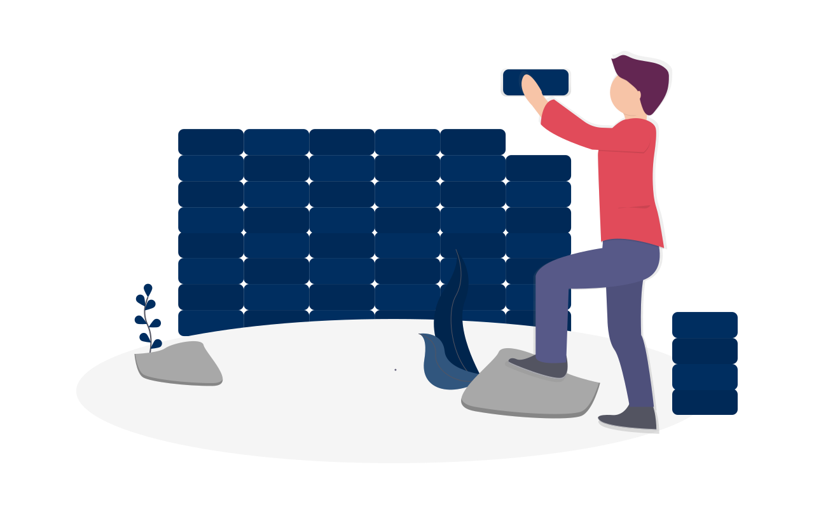

The Document Assembly Line project will help you produce **[beautiful guided interviews](https://courtformsonline.org)** 
more quickly.

Go straight from a PDF or DOCX file to a runnable prototype in less than an hour. Build out from
there with expert-vetted questions and standardized components.

We used [open source tools](https://docassemble.org) and [modern project
management techniques](https://trello.com) to:

* gather more than 200 volunteers from around the world
* break the process of document automation into a series of small steps, so a
  volunteer with just a few hours can still make a difference
* build a [tool](weaver_overview.md) that takes specially prepared court forms and turns them directly
  into draft [Docassemble](https://docassemble.org) interviews, ready to get
  feedback and iterate on
* draft easy to read questions and [guidelines](question_style_overview.md) to promote access to justice
  for users of all abilities and languages

## Our work 

The video below provides an overview of the project (0-10 min) and a detailed
look at one of the forms (12-30 min). _Note: This video is a lecture from the
course [Coding the
Law](https://www.codingthelaw.org/Fall_2020/level/3/#intro_vid). So please
disregard comments about "prior classes" and pending homework assignments at the
end._

<iframe width="560" height="315" src="https://www.youtube-nocookie.com/embed/AECHOvmaUv4" title="YouTube video player" frameborder="0" allow="accelerometer; autoplay; clipboard-write; encrypted-media; gyroscope; picture-in-picture" allowfullscreen></iframe>

<a class="button button--primary" href="https://courtformsonline.org">Visit CourtFormsOnline.org</a>

## Our tools

We built the **[Weaver](weaver_overview.md)** to help turn a [labeled](doc_vars_reference.md)
PDF or Word document into a draft of a guided interview.

We built a **library of model questions** for common court form fields, like:

* names and addresses
* the user's role in a court case
* contact information
* selecting and identifying a court

These questions have been written to target a 6th grade reading level and to be
usable by people with different abilities.

We built an **[electronic-filing
integration](https://github.com/SuffolkLITLab/EfileProxyServer)** for Tyler
Technologies EFMs so your finished court form can be delivered straight to an
electronic docket. It works in Louisiana's home-grown e-filing system, too.

We are in the process of building an **automated style checker** and
**visualization tool** to help courts and legal aid providers understand how
their forms can be improved, both on an individual form level and in the
aggregate.

## Form features

All of the forms produced by our tools:

* have a common look and feel, with reusable components
* mobile friendly layout so users can do everything on a smartphone
* help in context to guide users to filling in the form correctly
* use a standardized structure and questions to build consistency and gain trust
* use address autocompletion, to improve accuracy and save user time
* allow users to text, email, or share a link to their work in progress with a
  friend or advocate helping them complete a form
* integrated feedback form to help users report bugs or send praise quickly
* gather anonymized statistics in aggregate for reporting on usage
* use our database of court locations and jurisdictions in Massachusetts to
  guide users to file in the right venue
* digital signatures

Some forms can also be directly filed with a court, using either email,
our integration with Tyler Technologies, or our integration with
Louisiana's Jefferson Parish.

<!-- TODO: add some images of the features here -->

## Get involved

We operate out of [Suffolk Law's Legal Innovation and Technology
Lab](https://suffolklitlab.org/) in cooperation with the Massachusetts [Access
to Justice Commission](https://massa2j.org/) and are staffed almost entirely by
volunteers and students. We have optional standup meetings twice a week and
online trainings every Tuesday, all of which are recorded. See [prior
meetings](https://www.youtube.com/playlist?list=PLy6i9GFGw5GzcPqGyZQ06lPp35v6S5-YF).
Most of the group's work takes place on [MS
Teams](https://teams.microsoft.com/l/team/19%3a8b0fa1d62a014c7d9c27b69939e38644%40thread.tacv2/conversations?groupId=eaa9bd9d-cf39-4686-8f30-e55aa9d98c75&tenantId=78733fa9-540e-4eb8-bf29-73c4eeb63412).
If you are interested in joining the team, email "mass access at suffolk dot
edu," and we will send you an invite.

You can also email that address if you're interested in joining our [Document
Assembly Line
bootcamp](https://suffolklitlab.org/docassemble-AssemblyLine-documentation/docs/bootcamp).
The Bootcamp should give you a good feel for what the work entails and is where
we suggest you start to learn more.   

## Our Repositories

All code generated as part of this project is available for free on GitHub under
the MIT license.

- [The ALWeaver](https://github.com/SuffolkLITLab/docassemble-ALWeaver) for
  rapidly generating interactive court forms from marked-up templates.
- [The AssemblyLine docassemble
  package](https://github.com/SuffolkLITLab/docassemble-AssemblyLine) with
  runtime code and shared questions for interactive court forms.
    - [ALToolbox](https://github.com/SuffolkLITLab/docassemble-ALToolbox)
      contains functions and components that might benefit Docassemble
      developers who choose not to install the full Assembly Line framework.
    - [GithubFeedbackForm](https://github.com/SuffolkLITLab/docassemble-GithubFeedbackForm)
      helps Docassemble authors collect feedback from endusers and generate GitHub issues.
    - [ALRecipes](https://github.com/SuffolkLITLab/docassemble-ALRecipes)
      examples and snippets that use Assembly Line features or demonstrate best
      practices. Can be included directly in the Docassemble Playground to supplement the list
      of Playground examples.
    - [InterviewStats](https://github.com/SuffolkLITLab/docassemble-InterviewStats/) for
      gathering usage analytics.
- [PovertyScale](https://github.com/SuffolkLITLab/docassemble-PovertyScale) which contains
  a Python library, Docassemble code, static JSON and a REST server for determining income
  qualification based on the [United States Federal Poverty
  Scale](https://aspe.hhs.gov/topics/poverty-economic-mobility/poverty-guidelines), updated
  on an annual basis.
- [ALMassachusetts](https://github.com/SuffolkLITLab/docassemble-ALMassachusetts) with
  Massachusetts-specific questions and links to Massachusetts courts.
- [MACourts](https://github.com/GBLS/docassemble-MACourts) is maintained by Greater Boston
  Legal Services but has been expanded and improved by the Assembly Line Project. It contains
  a list of courts in Massachusetts and rules to determine jurisdiction and venue based on
  address.
- [MassAccess](https://github.com/SuffolkLITLab/docassemble-MassAccess) with branding
  specific to the [CourtFormsOnline.org](https://courtformsonline.org) website.
- [ALDashboard](https://github.com/SuffolkLITLab/docassemble-ALDashboard) an Assembly Line-
  independent tool that makes it easier to maintain a Docassemble server.
- [EFSP Integration](https://github.com/SuffolkLITLab/docassemble-EFSPIntegration/) which
  is a Python and Docassemble frontend for Suffolk Law School's electronic filing Java server.
- [EFileProxyServer](https://github.com/SuffolkLITLab/EfileProxyServer) which is a Java-based
  REST server which provides a simplified interface to [Tyler EFMs](https://www.tylertech.com/products/odyssey/file-serve),
  as well as an interface to JeffNet, the home-brew efiling server run by Jefferson Parish, Louisiana. Suffolk LIT Lab
  is currently in the process of being a certified Tyler E-Filing Service Provider (EFSP).

We have also produced draft or final [automations of almost 100 unique Massachusetts court forms](https://github.com/orgs/SuffolkLITLab/repositories)
during the lifetime of our project.

